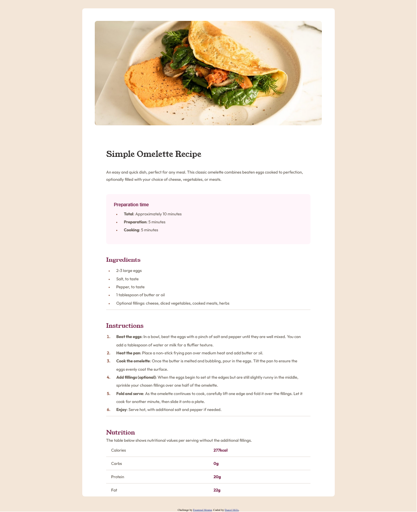

# Frontend Mentor - Recipe page solution

This is a solution to the [Recipe page challenge on Frontend Mentor](https://www.frontendmentor.io/challenges/recipe-page-KiTsR8QQKm). Frontend Mentor challenges help you improve your coding skills by building realistic projects. 

## Table of contents

- [Overview](#overview)
  - [Screenshot](#screenshot)
  - [Links](#links)
- [My process](#my-process)
  - [Built with](#built-with)
  - [What I learned](#what-i-learned)
  - [Continued development](#continued-development)
- [Author](#author)

## Overview

This was the first of the easy challenges on Frontend Mentor.  It was relatively easy, but I still learned a few things I did not know before.

### Screenshot

### Links

- Solution URL: [Add solution URL here](https://your-solution-url.com)
- Live Site URL: [Add live site URL here](https://your-live-site-url.com)

## My process

I started this build by wrapping all of the copy in the appropriate HTML elements, defining the different sections and deciding what elements were most appropriate.  I then started designing it from the mobile size, ensuring my design was very similar to that of Frontend Mentors.  Then I worked on the large size to make sure it looked like the full screen example.

### Built with

- Semantic HTML5 markup
- CSS custom properties
- Mobile-first workflow

### What I learned

In this project, I used the ::marker psuedo-element to style bullet points and number separate from the text of the element for the first time.  

li::marker {
    color: var(--brown-800);
    font-weight: 600;
}

### Continued development

Moving forward, I plan on trying to utilize units such as rem more in my CSS.

- Frontend Mentor - [djmills89](https://www.frontendmentor.io/profile/djmills89)

